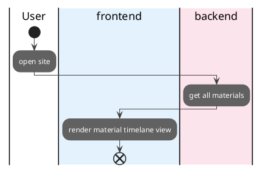

## Access the system
- ***ID***
    - UC-001
- ***Overview***
    - access the system
- ***Actors***
    - User
    - frontend
    - backend
- ***Predictions***
    - none
- ***Postcondition***
    - display the material timelanes
- ***Main Course***
    - User access the system page
    - backend get all available material info
    - frontend render top page
- ***Alternate Course***
    - none
- ***Exceptions***
    - none

