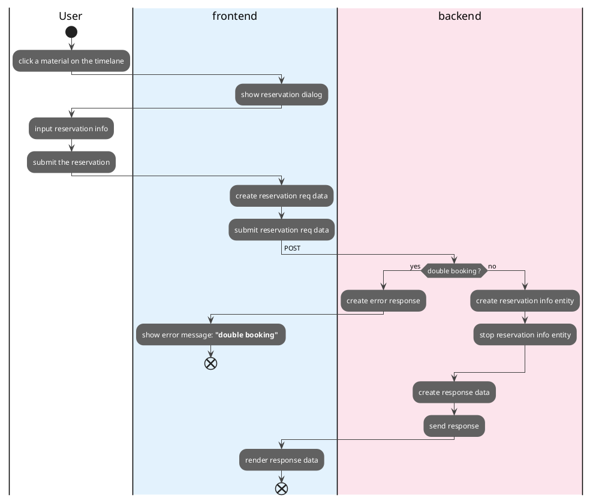

## Making a material reservation.

- ***ID***
    - UC-001
- ***Overview***
    - making material reservation
- ***Actors***
    - User
    - frontend
    - backend
- ***Predictions***
    - User accessed the system and system displayed top page
- ***Postcondition***
    - store reservation data into DB
    - display latest booking info on the page
- ***MC:Main Course***
    - 1: click a timelane of the material which you want to book
    - 2: input reservation info
    - 3: click the submit button
    - 4: display the reservation info on the timelane
- ***AC:Alternate Course***
    - after MC-1 or MC2
        - click the cancel button then JUST hide the input reservation dialog
    - after MC-3
        - display alert dialog with "double booking" message
        - click "OK" then hide the alert dialog
- ***EX:Exceptions***
    - after MC-3
        - display error dialog with error message when internal error or something occures

